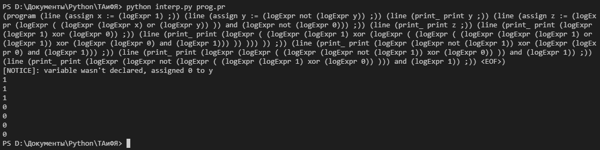
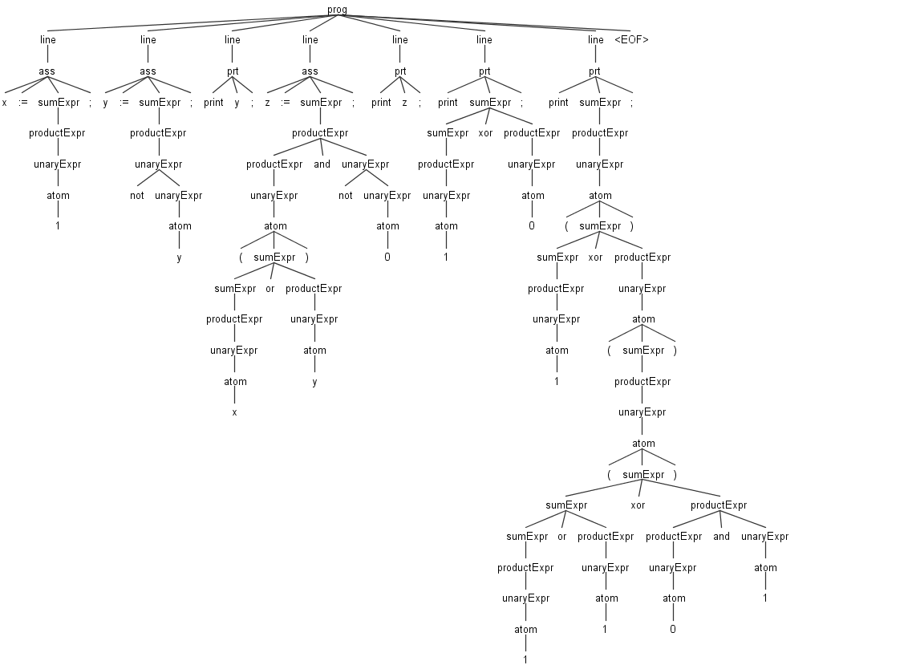

## Creation of language simple interpreter using ANTLR
### Problem
The input language contains assignment operators (:=) and print operators ending in ; (semicolon). In the left part of the assignment operator is an identifier, in the right part is a logical expression. Logical expressions consist of identifiers, constants 0 and 1, operations or, xor, and, not and round brackets. Operator print has an argument - the identifier of the variable.

Example:
```pascal
// example program
x := 1;
y := not y;
print y;
z := (x or y) and not 0;
print z;
```

### Implementation

#### Lexer-grammar syntax
The lexemes and grammar (syntax) of the language are described in [syntax.g4](syntax.g4).

#### Generation of handler classes
To obtain grammar handler classes (listener or visitor) to bypass the parse tree, create all additional token files, etc., you need to generate files using the ANLTR jar package in the desired final language:

```batch
java -jar .\antlr-4.7.2-complete.jar -Dlanguage=Python3 -visitor syntax.g4
```

#### Lexer-parser stream and visitor class creation

Next, you need to create an executable file to read the input file or stream to the lexer -> parser ([interp.py](interp.py)).

Then you need to create your own visitor class to bypass the grammatical structures of the parse tree [MyVisitor.py](MyVisitor.py).

#### Running a program

Example input file [prog.pr](prog.pr):
```pascal
x := 1;
y := not y;
print y;
z := (x or y) and not 0;
print z;

print 1 xor 0;
print (1 xor ((1 or 1 xor 0 and 1)));
print not 1 xor 0 and 1;
print (not 1 xor 0) and 1;
print not (1 xor 0) and 1;
```

To run a program in your new language use (pass to the lexer-parser stream file any program in your new language):
```batch
python interp.py prog.pr
```

#### Result of file execution
Here's what we should get (parse tree and print operators execution):



### Parse tree (visualization)
ANTLR uses the parse tree to bypass its parse classes, so we will use it to process grammar and visualize the tree.
Actually we need to recompile grammar files and classes into java, because to visualize the parse tree we need to use a component (TestRig) that works only with java classes. To do that let's write some simple batch file.
A file to run the GUI of the visualization ([java/run.bat](java/run.bat)):
```batch
// run.bat
java -jar antlr-4.7.2-complete.jar syntax.g4 -visitor
javac -cp "*" syntax*.java
java -cp .;antlr-4.7.2-complete.jar org.antlr.v4.gui.TestRig syntax program -tree -gui prog.pr
```

**Program example** ([prog.pr](prog.pr)):
```pascal
// prog.pr
x := 1;
y := not y;
print y;
z := (x or y) and not 0;
print z;

print 1 xor 0;
print (1 xor ((1 or 1 xor 0 and 1)));
print not 1 xor 0 and 1;
print (not 1 xor 0) and 1;
print not (1 xor 0) and 1;
```

**Full parse tree for the example** (with [MyVisitor.py](MyVisitor.py) and [syntax.g4](syntax.g4) as it is):

.png)
In this case you get all lexemes of logical values (atoms, operators, parentheses) under one name - the token logExpr. This helps to take a smaller place in the parse tree and the syntax file (*.g4*), but looks less structured and has no descriptive names for the lexeme.

**Parse tree (part) for the example** (with [MyVisitor_old.py](MyVisitor_old.py) and [syntax.g4](syntax.g4) (commented part):


Here you get more precise token names (lexems), but they take up more space in parse tree.